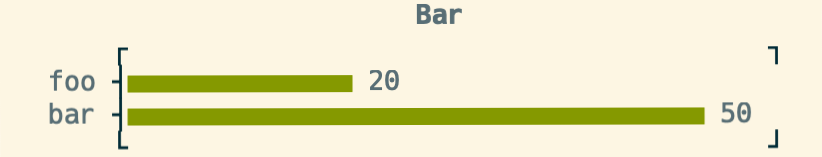
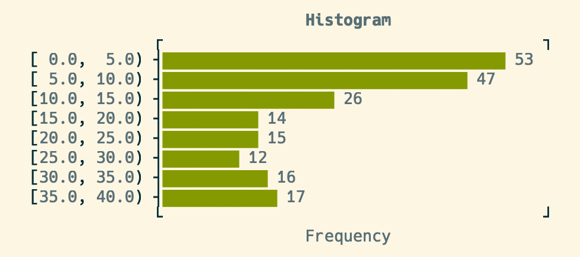
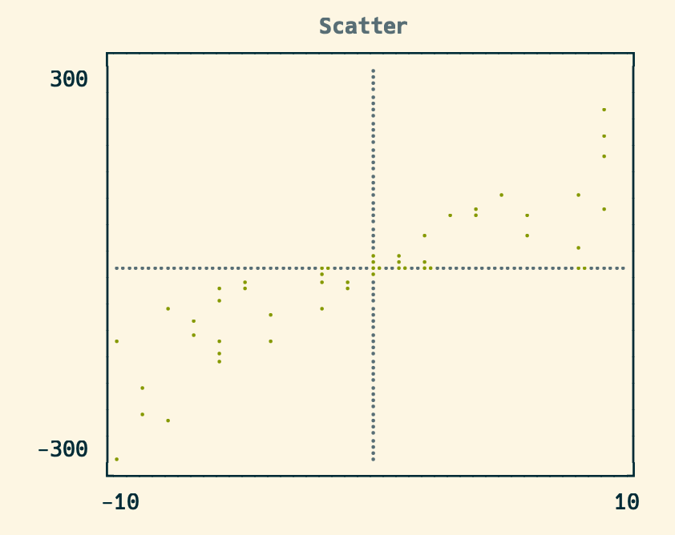

# UnicodePlot - Plot your data by Unicode characters

UnicodePlot provides the feature to make charts with Unicode characters.

## Install

```console
$ gem install unicode_plot
```

## Usage

```ruby
require 'unicode_plot'

x = 0.step(3*Math::PI, by: 3*Math::PI / 30)
y_sin = x.map {|xi| Math.sin(xi) }
y_cos = x.map {|xi| Math.cos(xi) }
plot = UnicodePlot.lineplot(x, y_sin, name: "sin(x)", width: 40, height: 10)
UnicodePlot.lineplot!(plot, x, y_cos, name: "cos(x)")
plot.render($stdout)
puts
```

You can get the results below by running the above script:


## Supported charts

### barplot

```ruby
plot = UnicodePlot.barplot(data: {'foo': 20, 'bar': 50}, title: "Bar")
plot.render($stdout)
```



### boxplot

```ruby
plot = UnicodePlot.boxplot(data: {foo: [1, 3, 5], bar: [3, 5, 7]}, title: "Box")
plot.render($stdout)
```


### densityplot

```ruby
x = Array.new(500) { 20*rand - 10 } + Array.new(500) { 6*rand - 3 }
y = Array.new(1000) { 30*rand - 10 }
plot = UnicodePlot.densityplot(x, y, title: "Density")
plot.render($stdout)
```


### histogram

```ruby
x = Array.new(100) { rand(10) } + Array.new(100) { rand(30) + 10 }
plot = UnicodePlot.histogram(x, title: "Histogram")
plot.render($stdout)
```



### lineplot

See [Usage](#usage) section above.

### scatterplot

```ruby
x = Array.new(50) { rand(20) - 10 }
y = x.map {|xx| xx*rand(30) - 10 }
plot = UnicodePlot.scatterplot(x, y, title: "Scatter")
plot.render($stdout)
```



## Acknowledgement

This library is strongly inspired by [UnicodePlot.jl](https://github.com/Evizero/UnicodePlots.jl).

## License

MIT License

## Author

- [Kenta Murata](https://github.com/mrkn)
